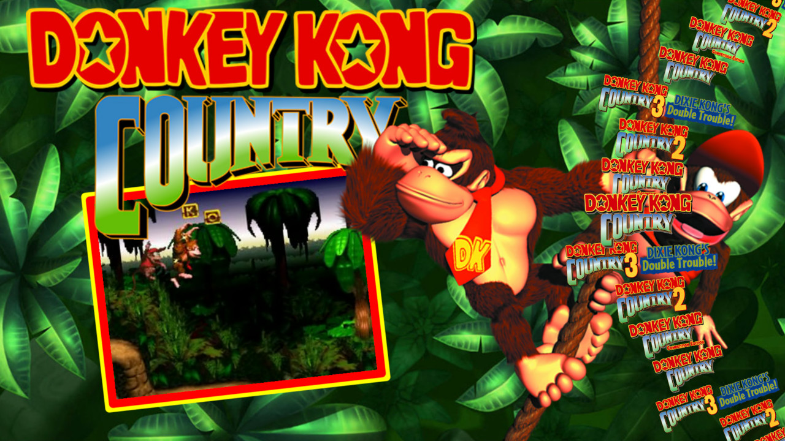

# ArcadeFrontend

ArcadeFrontend is an open source [Hyperspin](https://hyperspin-fe.com) alternative using [Godot - Mono](https://godotengine.org) that lets you generate themes on a per game basis.

Themes can be designed in Godot with no need to do any programming, but you can program if you like.

It's very much in alpha and is missing many features. This application is a very specific program and may not fit your needs.

If you want an already established front-end that runs on Linux I'd recommend [Pegasus Frontend](https://pegasus-frontend.org)

# HyperSpin Theme Support

ArcadeFrontend can now load a constrained subset of extracted HyperSpin themes directly at runtime.

Supported first-pass compatibility:
- `Theme.xml` plus sibling assets in the same folder
- `Background.png`
- `Artwork1.png` through `Artwork4.png`
- optional `video.ogv`, or a config-provided video override
- centered coordinates authored in `1024x768`
- non-uniform stretch to the active viewport to match HyperSpin's widescreen behavior
- limited intro effects using `start`, `time`, `delay`, and `type`

Explicit non-goals:
- Flash or SWF content
- full compatibility with all community HyperSpin themes
- automatic support for alternate video formats such as `mp4`, `avi`, or `mkv`

Example config:
```json
{
  "Name": "Metal Slug X",
  "Theme": {
    "Type": "HyperSpin",
    "Path": "themes/MetalSlugX/Theme.xml",
    "Video": "themes/MetalSlugX/video.ogv"
  }
}
```

For HyperSpin themes, `Theme.Video` is optional. If it is set, ArcadeFrontend uses that file for the theme's video region. If it is omitted, the loader falls back to `video.ogv` beside `Theme.xml`.

Existing packaged Godot themes using `ThemePck` and `ThemeFile` continue to work.

# Video Theme Support

ArcadeFrontend can also load a standalone `.ogv` as a full-screen theme background.

Example config:
```json
{
  "Name": "Example Game",
  "Theme": {
    "Type": "Video",
    "Path": "themes/example/background.ogv"
  }
}
```

Video themes are intentionally simple:
- the `.ogv` fills the whole viewport
- the video loops automatically
- there are no XML layout files or overlay assets

# Making Game Themes

This will most likely change, but using Godot:
- Make a scene in: `res://themes/<your_theme_name>/theme.tscn`
  - `Root Type` should be a  `Control` node and make sure it's *Anchor* spans the `Full Rect`.
  - Do whatever you want in that node.
    - GD Script works, but security implications may not be ideal.
    - Try to do everything via anchors: This __should__ let themes scale to other resolutions. 
  - Currently only tested in 1080p, other resolutions may not scale correctly (for now).
  - Don't need to do anything in GD Script, this [example theme](https://mrsharky.com/ArcadeFrontend/donkey_kong_country.pck) was all animated and done via Godot's editor.

# Setup

- Install and setup the Mono (C#) version of [Godot](https://godotengine.org)
  - Godot Mono will have it's own requirements. 
- Generate a `config.json` - please use [config_example.json](./config_example.json) file as an example
- In Godot, build out the project

# 🚧 Roadmap

## Core Functionality
- [x] Wheel menu for selecting games
 - [ ] Make the wheel prettier
 - [ ] Better wheel navigation - Currently only works on single presses
   - [ ] Allow multiple presses
   - [ ] Allow holding
- [x] Launch Applications
- [x] Dynamic theme loading via .pck files (currently only for individual menu items)
  - [ ] Research security implications (probably terrible)
  - [ ] Animated transitions between themes
  - [x] Allow "fall-back" themes (if no individual game theme is available)
    - If you put a theme in the top of the section (before the "items") that will be used as a default 
  - [ ] Setup a website where people can share themes.
- [ ] Load Hyperspin themes
  - [x] Very basic support. No flash, haven't implemented all animations
  - [ ] Figure out and implement all animations
- [x] Load video themes
  - [x] Can load videos as a fullscreen theme (useful for grabbing Video themes from [emumovies](https://emumovies.com))
  - [ ] I'm sure we can do more here
- [x] Exit back to menu when game exits
  - Program pauses when focus is lost
- [ ] Controller navigation (haven't tested, it "might" work?)
- [ ] In-app settings menu
- [x] Sub wheel menus
  - [ ] Need sub wheels to remember last location in previous wheel
- [ ] Different resolutions - currently setup for 1080p
- [x] Game Information screen (optional) - Thinking this should be something similar to the PS5 when a game is selected
  - [ ] Started work on a game information screen (see example in `config_example.json`). Still not complete.
  - [ ] Select different game versions in menu
  - [ ] Allow theming
  - [ ] Add more game information to screen
  - [ ] Add screenshot examples
- ...

## Development
- [ ] Setup [pre-commit](https://pre-commit.com) hooks
  - [ ] Find a good C# linter
- [ ] Auto-builds via Github Actions
  - [ ] Create an AppImage

## Wishlist
- [ ] No need to setup the `config.json` by hand.
  - [ ] Working on a clean database that will scan games and organize everything
  - [ ] The goal is for the `config.json` to be an override for themes instead. 
- [ ] Bring up an overlay on top of running games - Something like the Guide button on Xbox (not sure if this is possible)
- [ ] Get retroarch cores to run directly in app (crazy idea)

# Useful Developer commands:

- If using [nixos](https://nixos.org): `nixos_runner.sh` can be used to test a generated executable.
- Convert mp4 to Godot compatible video:
```shell
ffmpeg -i "input.mp4" -c:v libtheora -q:v 7 -c:a libvorbis -q:a 4 output.ogv
```

# License
ArcadeFrontend is available under GPLv3 license. Some included assets, such as product logos and symbols may not be available for commercial usage and/or may require additional permissions from their respective owners for certain legal uses. Furthermore, trademark usage may be limited as per §7 of the GPLv3 license. You can find the details in the [LICENSE](./LICENSE) file.

All trademarks, service marks, trade names, trade dress, product names and logos are property of their respective owners. All company, product and service names used in this product are for identification purposes only. Use of these names, logos, and brands does not imply endorsement.
